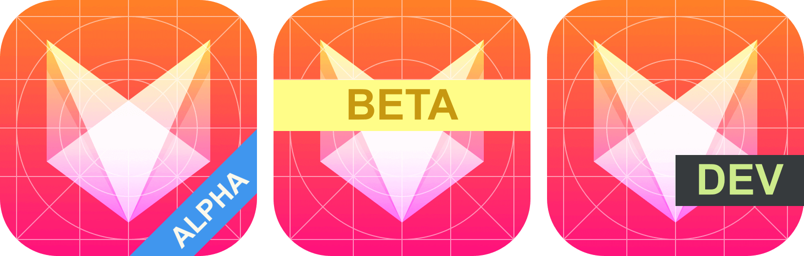

<p style="text-align: center">

</p>

# badger

A command-line tool that adds labeled badges to app icons. Useful for marking builds with environment labels like ALPHA, BETA, or DEV.

## Install

### Homebrew (macOS)

```bash
brew install hex/tap/badger
```

### Scoop (Windows)

```bash
scoop bucket add hex https://github.com/hex/scoop-bucket
scoop install badger
```

### Go

```bash
go install github.com/hex/badger@latest
```

### Download

Pre-built binaries for macOS (Intel & Apple Silicon), Linux (amd64 & arm64), and Windows are available on the [releases page](https://github.com/hex/badger/releases).

## Usage

```bash
badger --text "BETA" --icon path/to/icon.png
```

Output is written to `badgerOutput/` by default. Use `--overwrite` to modify the original file.

### Directory mode

Pass a directory (including `.appiconset` directories) to badge all icons:

```bash
badger --text "DEV" --icon path/to/AppIcon.appiconset
```

### Examples


```bash
badger --text ALPHA --icon icon.png --height 25 --angle -45 --horizontal-padding 60 --offsetx 65 --offsety 65
```


```bash
badger --text BETA --icon icon.png --color "#FFFD88" --text-color "#C79811" --badge-pivot center --offsety -25
```


```bash
badger --text DEV --icon icon.png --width 50 --color "#363A3D" --text-color "#CDEB8B" --offsety -100 --badge-pivot bottomRight
```

## Options

| Flag | Short | Default | Description |
|---|---|---|---|
| `--text` | | *required* | Badge text |
| `--icon` | | *required* | Icon path (.png, .jpg, .jpeg, or directory) |
| `--font-name` | | `inter` | Bundled font name or path to .ttf/.otf file |
| `--width` | | `100` | Badge width as % of icon width (0-100) |
| `--height` | | `20` | Badge height as % of icon height (0-100) |
| `--color` | | `#4096EE` | Badge background color (hex) |
| `--opacity` | | `1` | Badge opacity (0-1) |
| `--text-color` | | `#F9F7ED` | Badge text color (hex) |
| `--text-alignment` | | `center` | Text alignment: left, center, right |
| `--angle` | `-r` | `0` | Rotation angle (0-360) |
| `--offsetx` | `-x` | `0` | X-axis offset |
| `--offsety` | `-y` | `0` | Y-axis offset |
| `--badge-pivot` | | `bottomLeft` | Pivot: top, left, bottom, right, topLeft, topRight, bottomLeft, bottomRight, center |
| `--horizontal-padding` | | `5` | Text horizontal padding |
| `--vertical-padding` | | `0` | Text vertical padding |
| `--horizontal-pivot` | | `center` | Text horizontal pivot: left, center, right |
| `--vertical-pivot` | | `center` | Text vertical pivot: top, center, bottom |
| `--uppercase` | | `false` | Transform text to uppercase |
| `--letter-spacing` | | `0` | Extra spacing between characters (pixels) |
| `--text-outline-color` | | | Text outline color (hex, enables outline) |
| `--text-outline-width` | | `2` | Text outline width in pixels |
| `--text-shadow-color` | | | Text shadow color (hex, enables shadow) |
| `--text-shadow-x` | | `2` | Text shadow X offset |
| `--text-shadow-y` | | `2` | Text shadow Y offset |
| `--text-glow-color` | | | Text glow color (hex, enables glow) |
| `--text-glow-radius` | | `3` | Text glow radius in pixels |
| `--emboss` | | `false` | Apply emboss effect to text |
| `--overwrite` | `-o` | `false` | Overwrite input icon (destructive) |
| `--version` | | | Show version |

## Text Effects

Badger supports several text effects that can be combined:

### Outline

Adds a colored outline around badge text for improved readability:

```bash
badger --text "BETA" --icon icon.png --text-outline-color "#000000" --text-outline-width 3
```

### Shadow

Adds a drop shadow behind the text:

```bash
badger --text "BETA" --icon icon.png --text-shadow-color "#000000" --text-shadow-x 2 --text-shadow-y 2
```

### Glow

Adds a soft glow around the text:

```bash
badger --text "BETA" --icon icon.png --text-glow-color "#FFFFFF" --text-glow-radius 4
```

### Emboss

Creates a subtle 3D embossed text effect:

```bash
badger --text "BETA" --icon icon.png --emboss
```

### Combining Effects

Effects can be combined freely:

```bash
badger --text "alpha" --icon icon.png --uppercase --letter-spacing 3 \
  --text-outline-color "#000000" --text-shadow-color "#333333"
```

## Bundled Fonts

Badger ships with two embedded fonts so it works without system font dependencies:

- **inter** (default) — [Inter Bold](https://rsms.me/inter/) (SIL Open Font License)
- **roboto** — [Roboto Bold](https://fonts.google.com/specimen/Roboto) (Apache License 2.0)

Custom fonts can be used by passing a file path to `--font-name`.

## License

MIT
